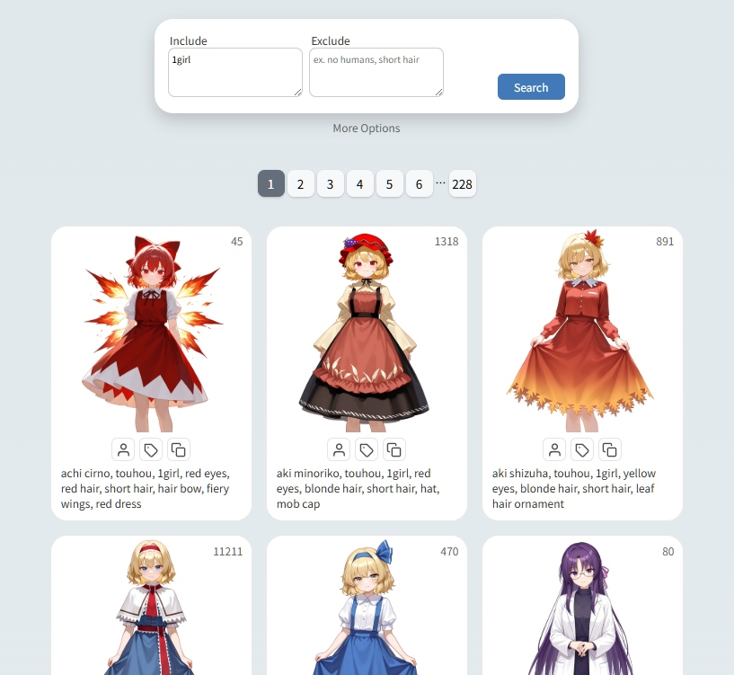

English | [中文](README.zh_TW.md)

<h1 align="center">
Drawing Spells
</h1>

Drawing Spells is a prompt query tool for anime/game characters, designed for use with AI image generation.

Both Illustrious and NoobAI-XL are highly advanced AI drawing models. Even without using LoRA, as long as the prompts contain the correct character names and clothing descriptions, thousands of anime/game characters can be accurately generated.

## How to Use

This project does not require a server. After downloading the project, simply open `index.html` in your browser.

Or use it online directly: https://hbl917070.github.io/DrawingSpells

## Tips

- Some users may prefer specific attributes. For example, regardless of the character's original hairstyle, you may always want to change the character to have long hair. 
If you have this need, you can use the "Ignore Prompts When Copying" feature in Advanced Settings. 
Add prompts related to hairstyles such as `short hair, *ponytail, twintails, horse tail,` etc. 
This allows you to quickly copy only the prompts you want.

- All settings are recorded in the URL, so you can share your search results just by sharing the link, like [this](https://hbl917070.github.io/DrawingSpells/?page=1&include=1girl%0Ahonkai%3A+star+rail&exclude=&sort=default&pageSize=50&excludeCount=1&ignorePrompts=1girl%2C).

- The default sorting is by series/work. If you enjoy gacha draws, you can set the sorting method to `random`.

## Related Resources
- Character prompt source: [e621-2024-webp-4Mpixel](https://huggingface.co/datasets/NebulaeWis/e621-2024-webp-4Mpixel)
- Preview model used: [NAI-XL vpred1.0 2d accelerated](https://civitai.com/models/1201815?modelVersionId=1870504)

## Copyright Notice

The code in this project is licensed under MIT, please see [LICENSE](LICENSE) for details.
  
All AI-generated images and character names displayed in this project remain the copyright of their original creators and companies. 
This project is for technical demonstration and academic research purposes only, with no commercial use.
 
If any copyright holders believe that any content in this project may infringe their rights, please contact us and we will promptly remove the relevant materials.
