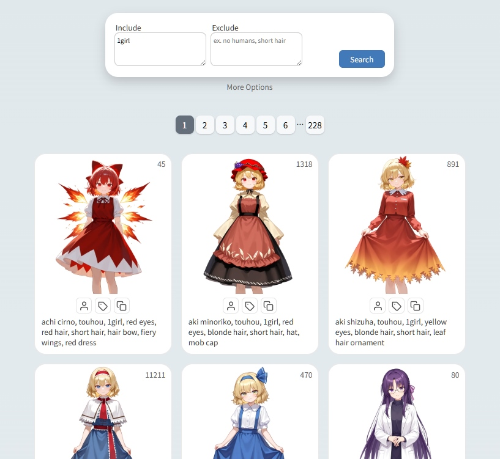

[English](README.md) | 中文

<h1 align="center">
Drawing Spells
</h1>

Drawing Spells 是一個二次元角色的提示詞查詢工具，這些提示詞可用於 AI 繪圖。

 Illustrious 與 NoobAI-XL 都是非常強大的 AI 繪圖模型，即使在沒有使用 LoRA 的情況下，只要提示詞含有正確的 角色名稱 與 服飾描述，就能準確生成數千名二次元角色。

## 專案使用方式

本專案不依賴伺服器，下載專案後，即可用瀏覽器開啟 `index.html` 

或是直接在線使用：https://hbl917070.github.io/DrawingSpells

## 使用技巧

- 某些人可能特別偏好特定屬性，例如：不論角色原本什麼髮型，都一定要將角色改成長髮， 
有這需求的話，可以在進階設定裡面使用 `複製時忽略提示詞` 的功能， 
將 `short hair, *ponytail, twintails, horse tail,` 之類有關髮型的提示詞加入， 
這樣就可以迅速的只複製自己想要的提示詞。

- 所有設定都會記錄在網址裡面，所以只要用網址就可以分享查詢結果，像 [這樣](https://hbl917070.github.io/DrawingSpells/?page=1&include=1girl%0Ahonkai%3A+star+rail&exclude=&sort=default&pageSize=50&excludeCount=1&ignorePrompts=1girl%2C)

- 預設的排序是依照作品，喜歡玩抽卡的人可以將排序方式設定為`隨機`

## 相關資源
- 角色提示詞來源 [e621-2024-webp-4Mpixel](https://huggingface.co/datasets/NebulaeWis/e621-2024-webp-4Mpixel)
- 角色預覽圖使用的模型 [NAI-XL vpred1.0 2d accelerated](https://civitai.com/models/1201815?modelVersionId=1870504)

## 版權說明

專案內的程式碼為 MIT 授權許可，詳情請參閱 [LICENSE](LICENSE)
  
本專案所展示之AI生成圖片及角色名稱，其著作權皆屬於各原創作者及公司所有 
本專案僅供技術展示及學術研究使用，無任何商業用途
 
若有權利人認為本專案之內容有侵權疑慮，請聯絡我們，我們將儘速下架相關資料
